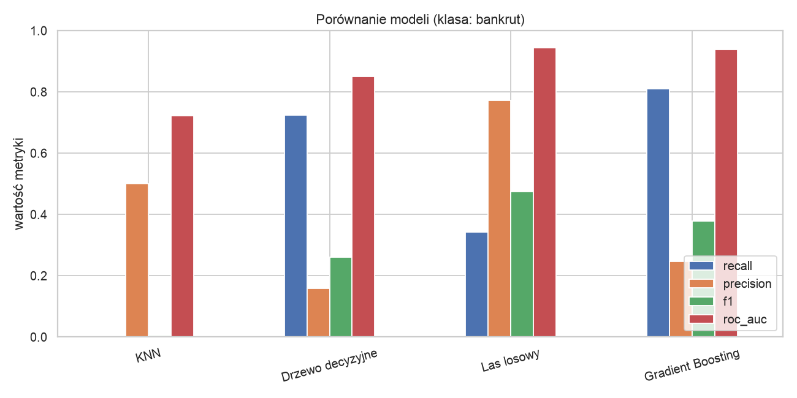
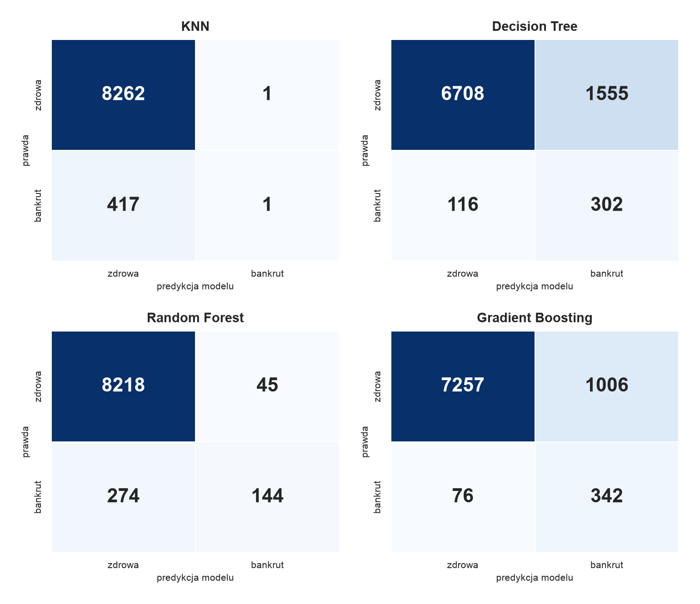
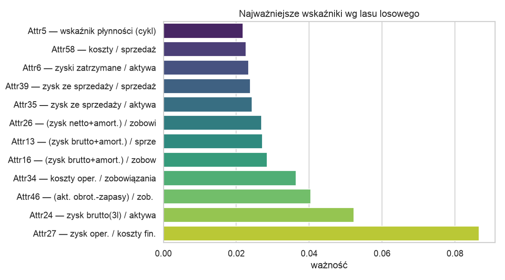

# 🏢💀 Bankrupt-AI — przewidywanie bankructwa polskich firm

Projekt zaliczeniowy z przedmiotu **Uczenie maszynowe w Python — laboratorium** (CDV, grupa 4).

> Model uczenia maszynowego, który na podstawie wskaźników finansowych firmy przewiduje,
> czy grozi jej bankructwo — wraz z interaktywną stroną www i analizą kosztową dla banku/inwestora.

**🔴 Demo na żywo: [predykcja-bankructwa.vercel.app](https://predykcja-bankructwa.vercel.app)**

---

## 👤 Skład zespołu

- **Wojciech Płonka** — projekt indywidualny (solo)

---

## 🎯 Koncepcja projektu

Celem jest zbudowanie i porównanie kilku modeli klasyfikacyjnych, które na podstawie
**64 wskaźników finansowych** przedsiębiorstwa (płynność, zadłużenie, rentowność, rotacja)
przewidują, czy firma **zbankrutuje** w nadchodzącym okresie.

Projekt nie kończy się na samym modelu — powstaje też **interaktywna strona internetowa**,
na której można wpisać dane firmy i otrzymać werdykt wraz z wyjaśnieniem (które wskaźniki
najbardziej wpłynęły na decyzję) oraz **scenariuszem kosztowym** (ile traci instytucja
finansowa na błędnej decyzji kredytowej).

### Dane

- **Źródło:** [Polish Companies Bankruptcy Data — UCI Machine Learning Repository](https://archive.ics.uci.edu/dataset/365/polish+companies+bankruptcy+data)
- **Opis:** dane ~10 000 polskich firm zebrane przez Emerging Markets Information Service,
  64 wskaźniki finansowe (Attr1–Attr64) + etykieta `class` (0 = firma przetrwała, 1 = bankructwo).
- **Charakterystyka:** dane silnie **niezbalansowane** (bankrutów jest ~2–7%) oraz z **brakami danych** —
  co czyni je realistycznym, „brudnym" zbiorem wymagającym czyszczenia i odpowiednich technik.

### Planowane modele

| Model | Po co |
|---|---|
| **K-Nearest Neighbors (KNN)** | baza odniesienia, wymaga skalowania danych |
| **Decision Tree** | interpretowalny, daje regułki decyzyjne |
| **Random Forest** | mocniejszy zespół drzew, zwykle najlepszy wynik |
| **Gradient Boosting / XGBoost** | model premium do porównania |

Dodatkowo: porównanie **różnych konfiguracji** (np. liczba sąsiadów w KNN, głębokość drzewa),
techniki radzenia sobie z niezbalansowaniem (**SMOTE / class_weight**) oraz **SHAP** do wyjaśniania decyzji.

### Wizualizacje

- rozkład bankrutów vs zdrowych firm, mapa ciepła korelacji wskaźników
- porównanie skuteczności modeli (accuracy / precision / recall / F1)
- macierz pomyłek, krzywa precision-recall
- **interaktywna strona www** (Next.js + wykresy) — formularz „sprawdź firmę"
- **scenariusz kosztowy** — koszt błędnych decyzji w zł

---

## 🗂️ Struktura repozytorium

```
.
├── notebook/                       # część ML (Jupyter/Colab)
│   ├── 01_dane_i_eksploracja.ipynb # dane → opis → czyszczenie → wizualizacje
│   ├── 02_modele.ipynb             # trening, ocena, SHAP, scenariusz kosztowy
│   └── archiwum_gpw/               # porzucony wariant tematu (indeksy GPW)
├── scripts/train_and_export.py     # silnik: trening + eksport modelu dla strony
├── artefakty/                      # wykresy wyników + metryki (JSON)
├── web/                            # strona Next.js (deploy na Vercel)
└── README.md
```

## 🛠️ Stack technologiczny

- **ML:** Python, pandas, scikit-learn, SHAP, matplotlib/seaborn (Google Colab)
- **Web:** Next.js, TypeScript — model (Gradient Boosting) liczony w przeglądarce w czystym JS
- **Hosting:** Vercel | **Kod:** GitHub

---

## 📊 Wyniki

Cztery modele wytrenowano na 80% danych (43 405 firm, 4,82% bankrutów) i przetestowano na 20%.
Ze względu na niezbalansowanie kluczowe są metryki dla klasy „bankrut", a nie ogólna trafność.

| Model | Trafność | Czułość | Precyzja | F1 | AUC |
|---|---|---|---|---|---|
| KNN | 0,952 | 0,002 | 0,500 | 0,005 | 0,722 |
| Decision Tree | 0,807 | 0,723 | 0,163 | 0,266 | 0,854 |
| **Random Forest** ⭐ | **0,963** | 0,344 | **0,762** | **0,474** | **0,945** |
| Gradient Boosting | 0,875 | **0,818** | 0,254 | 0,387 | 0,937 |




**Najważniejsze wskaźniki** (wg lasu losowego) to miary rentowności, zadłużenia i zdolności do obsługi
zobowiązań:



### Scenariusz kosztowy

Przy założeniu, że przeoczony bankrut kosztuje 200 000 zł, a fałszywy alarm 5 000 zł, najtańszy okazuje się
**Gradient Boosting** (≈ 20 mln zł) — model o najwyższej czułości, a **nie** ten o najwyższej trafności.
To pokazuje, że dobór modelu powinien wynikać z kosztu błędów, a nie z pojedynczej metryki.

## 🧠 Wnioski

- Sama **trafność (accuracy) jest myląca** przy ~5% bankrutów — KNN osiąga 95% trafności, nie wykrywając
  praktycznie żadnego bankruta.
- **Równoważenie klas** (`class_weight` / `sample_weight`) jest niezbędne, by model w ogóle wykrywał bankrutów.
- **Nie ma jednego „najlepszego" modelu** — Random Forest daje najlepszy balans (F1, AUC), a Gradient Boosting
  wyłapuje najwięcej bankrutów. Wybór zależy od kosztu błędów (patrz scenariusz kosztowy).
- Wskazania modelu są spójne z intuicją ekonomiczną, co potwierdza analiza **SHAP**.
